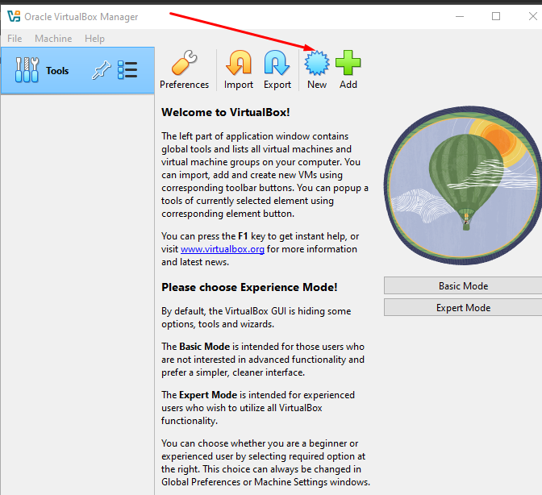
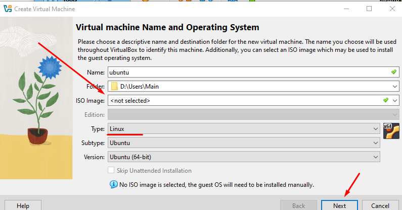
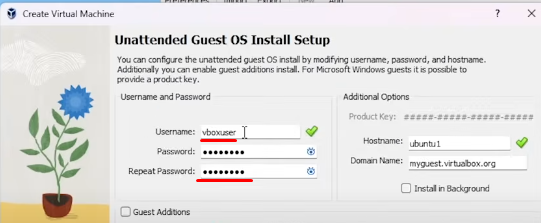
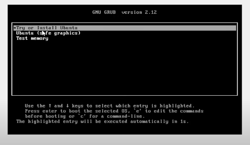

> Роботу виконували: Білоус Майя, Коломієць Артем, Танєєва Анастасія

> Виконувала Білус Майя
2. Опишіть набір базових дій в встановленому Вами гіпервізорі:
- Створення нової віртуальної машини - для створення нової віртуальної машини в VMware Fusion потрібно запустити програму і вибрати "Create New" або перейти в меню File → New. Далі слід вибрати джерело для встановлення операційної системи. Після цього налаштувати параметри, такі як кількість ядер CPU, обсяг оперативної пам'яті та розмір жорсткого диска, а потім завершити процес, натиснувши Finish, що розпочне встановлення ОС.
- Вибір/додавання обладнання - щоб змінити або додати обладнання до віртуальної машини, необхідно зайти в налаштування через Settings. У вкладці Hardware можна налаштувати компоненти, такі як CPU, пам'ять, жорсткий диск, мережеві адаптери і USB-пристрої.
- Налаштування мережі та підключення до Wi-Fi - щоб налаштувати мережу в віртуальній машині, потрібно перейти в розділ Network Adapter. У цьому розділі вибирають тип підключення: Bridged, NAT або Host-Only. VMware Fusion автоматично підключить віртуальну машину до Wi-Fi мережі хост-комп'ютера. 
- Робота з зовнішніми носіями (USB) - для підключення USB-пристроїв до віртуальної машини треба спершу підключити флешку або інший пристрій до комп'ютера. Потім у VMware Fusion потрібно вибрати Devices → USB Devices та вказати потрібний пристрій. Він стане доступним для віртуальної машини після вибору. Для підтримки USB-пристроїв необхідно також додати USB Controller у налаштуваннях віртуальної машини.

> Виконував Коломієць Артем
3. 

We need to download distributive which we preferred (in my case latest Ubuntu version)

After downloading VisualBox we gonna create new VM by clicking "New"

In "ISO image " we choosing our file "ubuntu" and we will see,thats type change to "Linux"

An than we have to configure our VM.(By creating username,password)

Then we could configure our "memory" settings. Choosed 2 CPU and 2048 base memory with 20 gb of disk size(on virtual machine)
And then we installing ubuntu

> Виконувала Танєєва Анастасія
